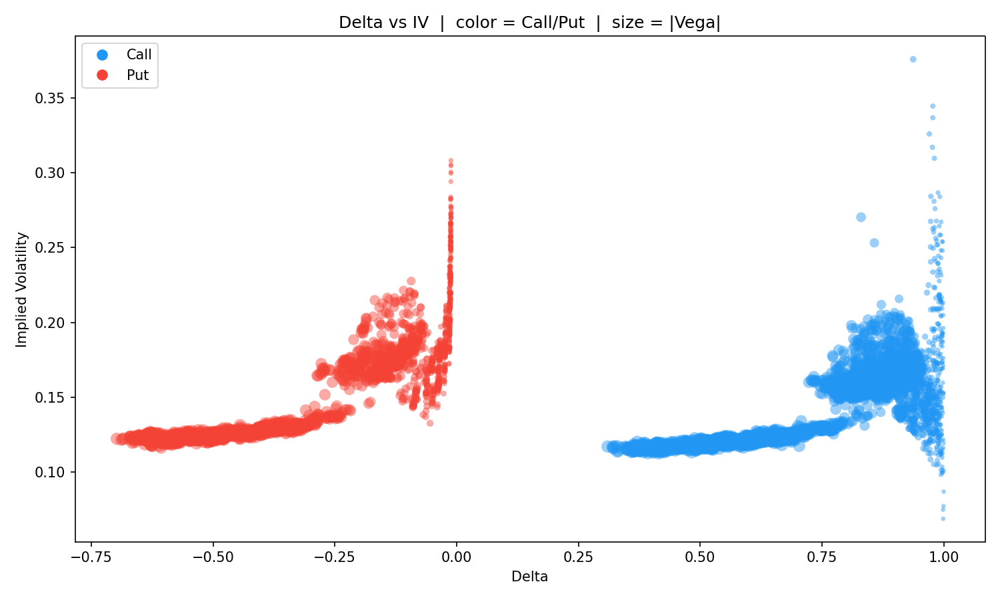
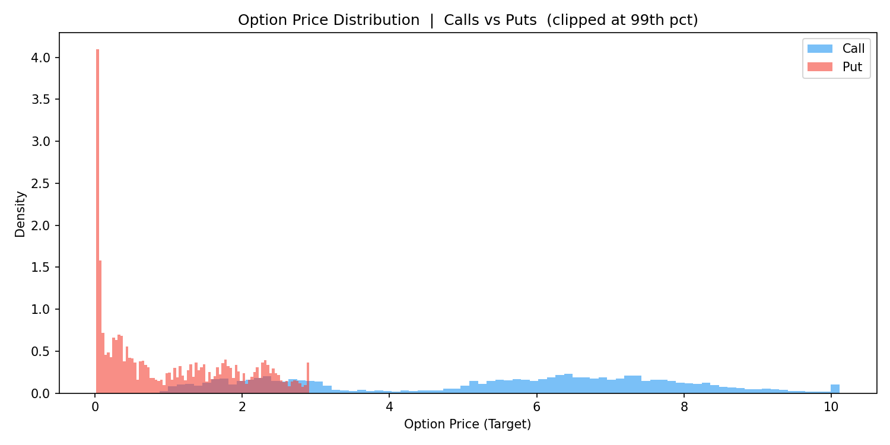
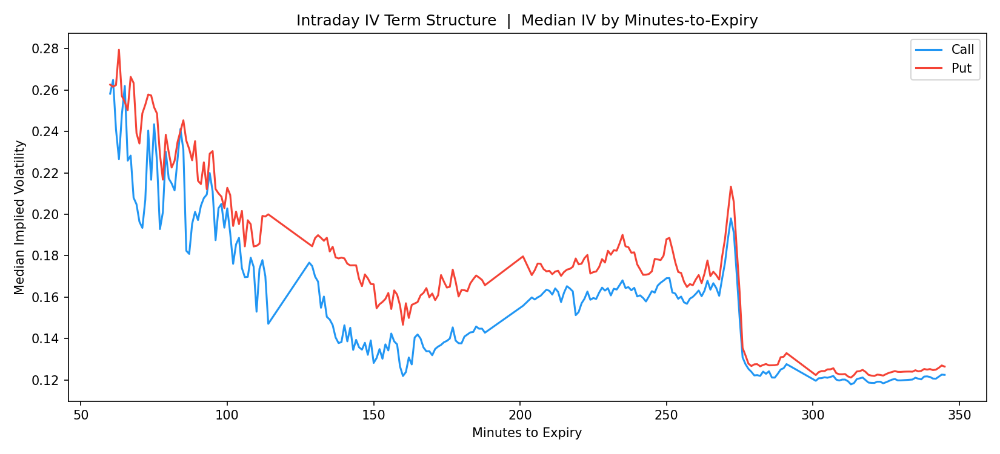
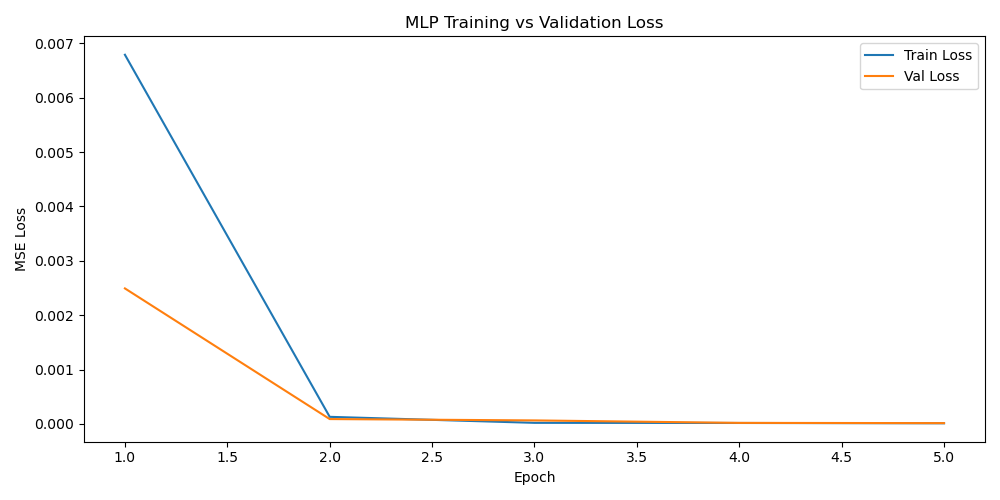
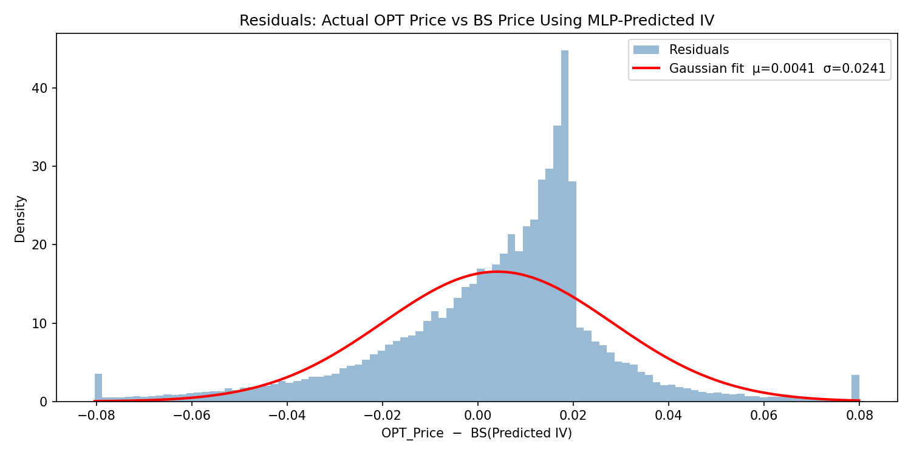
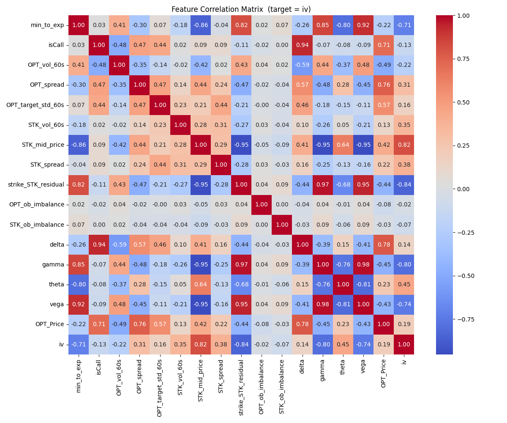

# HFT Research — 0DTE Options Implied Volatility Prediction

An end-to-end quantitative research pipeline that streams live tick data from Interactive Brokers, reconstructs limit order books, engineers microstructure features with Black-Scholes Greeks, and trains a multi-layer perceptron to predict implied volatility for same-day-expiry (0DTE) SPY options.

Question: Can we use live order book and trade data, combined with Black-Scholes Greeks, to predict the implied volatility of same-day-expiry SPY options?

https://www.youtube.com/watch?v=Tld8Jt8V3I0

---

## Table of Contents

1. [Makefile Reference](#makefile-reference)
2. [Overview](#overview)
3. [Prerequisites](#prerequisites)
4. [Project Structure](#project-structure)
5. [Pipeline](#pipeline)
   - [Stage 1 — Live Data Acquisition](#stage-1--live-data-acquisition)
   - [Stage 2 — PostgreSQL Storage](#stage-2--postgresql-storage)
   - [Stage 3 — Feature Engineering](#stage-3--feature-engineering)
   - [Stage 4 — Exploratory Analysis & Graphs](#stage-4--exploratory-analysis--graphs)
   - [Stage 5 — MLP Training & Evaluation](#stage-5--mlp-training--evaluation)
6. [Results](#results)
7. [Graphs & Analysis](#graphs--analysis)
8. [Quickstart](#quickstart)

---

## Makefile Reference

Quickstart
Before running any of the following commands, ensure TWS/IB Gateway is open and running, and your PostgreSQL database is up with credentials configured in Source/IBKR_Storing_Data.py.

Step 1 — Create environment and install dependencies

make env

##This creates a conda environment called Research with Python 3.11, strips conda-specific URL metadata from txt/requirements.txt, and installs all pinned packages via pip.

Step 2 — Pull live data from IBKR (requires paid IBKR account + running TWS)

make pull_data

##Connects to TWS on the default socket port, requests the SPY option chain, subscribes to L2 stock depth and L1 option quotes, and batches all incoming ticks to PostgreSQL every 30 seconds. Run during market hours. Stop with Ctrl+C when sufficient data has been collected.

Step 3 — Engineer features (requires data in PostgreSQL)

make feature_engineer

##Streams option_orders from PostgreSQL in 50K-row chunks, reconstructs order books, computes Black-Scholes Greeks and IV for every observation, and writes Data/0dteX.csv.

Step 4 — Generate exploratory graphs (requires 0dteX.csv)

make graphs

##Reads Data/0dteX.csv and writes three EDA plots to Graphs/.

Step 5 — Train and evaluate the MLP (requires 0dteX.csv)

make run_model

##Runs the full 24-configuration hyperparameter grid search with 3-fold time-series CV, selects the best model, trains for 25 epochs on the full training split, and evaluates on the held-out test set. Outputs metrics to stdout and writes Graphs/mlp_loss_curve.png and Graphs/residual_histogram.png.

Cleanup

make clean     # remove __pycache__ and .pyc files
make remove    # delete the entire Research conda environment


---

## Overview

This project investigates whether real-time market microstructure signals — order book imbalance, VWAP residuals, bid-ask spreads, intraday volume — can predict the implied volatility of 0DTE SPY options better than Black-Scholes alone. Data is collected live through the IBKR TWS API, stored in PostgreSQL with nanosecond timestamps, cleaned and featurized into an 18-column matrix, and fed into a grid-searched MLP that is evaluated with time-series cross-validation.

The full pipeline runs entirely from `make` commands. Every stage — environment setup, data pull, feature engineering, visualization, model training, and cleanup — is automated.

---

## Prerequisites

> **This pipeline will not run without the following external services configured.**

### Interactive Brokers (IBKR) — Paid Account Required

- A funded **live or paper** IBKR account with market data subscriptions for US equities and options.
- **Trader Workstation (TWS)** or **IB Gateway** running locally with the API enabled (`Edit → Global Configuration → API → Enable ActiveX and Socket Clients`).
- Default socket port: `7497` (TWS paper), `7496` (TWS live), `4002` (IB Gateway).
- Without a paid IBKR subscription, `make pull_data` will connect but receive no market data.

### PostgreSQL Database

- A running PostgreSQL instance (local or remote) accessible from your machine.
- Database credentials must be set in `Source/IBKR_Storing_Data.py` before running:

```python
conn = psycopg.connect(
    host="localhost",
    dbname="your_db",
    user="your_user",
    password="your_password"
)
```

- The `option_orders` table is created automatically on first run if it does not exist.

### Conda

- [Miniconda](https://docs.conda.io/en/latest/miniconda.html) or Anaconda must be installed and on your `PATH`.
- All Python dependencies are installed into an isolated conda environment named `Research`.

---

## Project Structure

```
Main/
├── Source/
│   ├── IBKR_Pulling_Data.py              # Stage 1: Live TWS API data collection
│   ├── IBKR_Storing_Data.py              # Stage 2: PostgreSQL schema + insert/query
│   ├── Cleaning_and_Feature_Engineering.py  # Stage 3: Order book reconstruction + Greeks
│   ├── MLP.py                            # Stage 5: Neural network training & evaluation
│   └── config.yaml                       # Hyperparameter grid configuration
├── Graphs/
│   ├── Graph_visualizations.py           # Stage 4: EDA plots from 0dteX.csv
│   ├── scatter_delta_iv.png
│   ├── hist_option_price.png
│   ├── line_iv_term_structure.png
│   ├── mlp_loss_curve.png
│   ├── residual_histogram.png
│   └── feature_correlation_matrix.png
├── Data/
│   ├── 0dteX.csv                         # Feature matrix output (~1M rows)
│   └── options_meta_data.json            # SPY option chain metadata snapshot
├── txt/
│   ├── requirements.txt                  # Full pinned dependency list
│   ├── Results_Testing.txt               # Hold-out test metrics
│   └── Results_CrossVal.txt             # Full grid search CV output
├── Makefile
└── README.md
```

---

## Pipeline

```
 ┌─────────────────────────┐
 │  IBKR TWS / IB Gateway  │  (live market data)
 └────────────┬────────────┘
              │  ibapi socket
              ▼
 ┌─────────────────────────┐
 │  IBKR_Pulling_Data.py   │  L2 stock depth + L1 option quotes
 │  (Stage 1)              │  + tick-by-tick historical data
 └────────────┬────────────┘
              │  batch insert every 30s
              ▼
 ┌─────────────────────────┐
 │      PostgreSQL          │  option_orders table
 │  (Stage 2)              │  nanosecond event timestamps
 └────────────┬────────────┘
              │  streaming 50K-row chunks
              ▼
 ┌──────────────────────────────────────┐
 │  Cleaning_and_Feature_Engineering.py │  order book reconstruction
 │  (Stage 3)                           │  Black-Scholes Greeks + IV
 └────────────┬─────────────────────────┘
              │  writes
              ▼
 ┌─────────────────────────┐
 │      Data/0dteX.csv     │  ~1M rows, 18 features
 └──────┬──────────────────┘
        │                   │
        ▼                   ▼
 ┌────────────┐     ┌────────────────────┐
 │  Graphs/   │     │      MLP.py        │
 │  (Stage 4) │     │     (Stage 5)      │
 │  EDA plots │     │  grid search + CV  │
 └────────────┘     │  final train/test  │
                    └────────────────────┘
```

---

### Stage 1 — Live Data Acquisition

**File:** [Source/IBKR_Pulling_Data.py](Source/IBKR_Pulling_Data.py)

Connects to a running TWS/IB Gateway instance via the `ibapi` socket and subscribes to three data streams simultaneously:

| Stream | Method | Description |
|--------|--------|-------------|
| L2 Stock Depth | `req_opt_L2()` | 5-level bid/ask order book for SPY |
| L1 Option Quotes | `req_L1_OPT_Market_Data()` | Top-of-book for each option contract |
| Tick-by-Tick Historical | `req_Historical_tick_by_tick_data()` | Bid/ask/midpoint history |

**Option chain discovery** runs first via `create_options_metadata()`, which queries all available strikes and expirations for the target ticker and writes the result to `Data/options_meta_data.json`. This metadata drives which contracts receive L1 subscriptions.

A dedicated background thread batches all incoming ticks into lists and bulk-inserts them into PostgreSQL every 30 seconds to minimize lock contention during active market hours.

**Target tickers:** SPY, QQQ, IWM, AAPL, TSLA, AMD, META, MSFT

---

### Stage 2 — PostgreSQL Storage

**File:** [Source/IBKR_Storing_Data.py](Source/IBKR_Storing_Data.py)

All tick data lands in a single `option_orders` table:

```sql
CREATE TABLE option_orders (
    id              BIGSERIAL PRIMARY KEY,
    secType         TEXT,            -- 'STK' or 'OPT'
    reqId           INTEGER,
    ticker          TEXT,
    exchange        TEXT,
    option_exp      TEXT,            -- YYYYMMDD
    strike          DOUBLE PRECISION,
    option_right    TEXT,            -- 'C' or 'P'
    position        INTEGER,         -- order book depth level
    operation       INTEGER,         -- 0=insert, 1=update, 2=delete
    side            INTEGER,         -- 0=ask, 1=bid, 2=trade
    price           DOUBLE PRECISION,
    size            INTEGER,
    time            TEXT,            -- human-readable timestamp
    event_timestamp BIGINT           -- nanosecond Unix timestamp
);
```

The nanosecond `event_timestamp` is the primary ordering key for all downstream processing. The `operation` field enables full L2 book reconstruction — inserts, updates, and deletions are all preserved, not just snapshots.

---

### Stage 3 — Feature Engineering

**File:** [Source/Cleaning_and_Feature_Engineering.py](Source/Cleaning_and_Feature_Engineering.py)

The most computationally intensive stage. Streams the `option_orders` table in 50,000-row chunks to avoid loading the full dataset into memory, then reconstructs order books and computes features per option contract.

#### Order Book Reconstruction

Raw tick events with `operation` codes are replayed in timestamp order to rebuild the live bid/ask ladder at each point in time. Three book types are reconstructed:

- **`df_STK_order_book()`** — 5-level L2 ladder for the underlying stock
- **`df_OPT_order_book()`** — top-of-book for each option contract
- **`df_Trades()`** — executed transactions extracted from the tick stream

#### Feature Set (18 columns)

| Feature | Description |
|---------|-------------|
| `min_to_exp` | Minutes until option expiry at time of observation |
| `isCall` | 1 = call, 0 = put |
| `OPT_vol_60s` | Option volume traded in the prior 60 seconds |
| `OPT_spread` | Option bid-ask spread |
| `OPT_target_std_60s` | Rolling 60s standard deviation of option mid-price |
| `OPT_ob_imbalance` | (bid_size − ask_size) / (bid_size + ask_size) at the option book |
| `STK_vol_60s` | Underlying stock volume in prior 60 seconds |
| `STK_mid_price` | Current stock mid-price |
| `STK_spread` | Stock bid-ask spread |
| `STK_ob_imbalance` | L2 order imbalance for the underlying stock |
| `strike_STK_residual` | Strike price minus current stock mid-price (moneyness proxy) |
| `OPT_vwap_residual` | Option mid-price minus its 60s VWAP |
| `STK_vwap_residual` | Stock mid-price minus its 60s VWAP |
| `delta` | Black-Scholes delta |
| `gamma` | Black-Scholes gamma |
| `theta` | Black-Scholes theta (per calendar day) |
| `vega` | Black-Scholes vega (per 1% IV move) |
| `iv` | Implied volatility (target) — solved via Brent's method |

#### Black-Scholes Greeks & IV Computation

Greeks are computed vectorized across all rows using the closed-form BSM formulas. Implied volatility is back-solved from the observed mid-price using scalar Brent's method with bounds `[1e-6, 10.0]`. Edge cases (zero time-to-expiry, zero or negative prices) are handled with floor values before any computation.

**Output:** `Data/0dteX.csv` — approximately 1 million rows covering SPY 0DTE options with 0–6 hours remaining to expiry.

---

### Stage 4 — Exploratory Analysis & Graphs

**File:** [Graphs/Graph_visualizations.py](Graphs/Graph_visualizations.py)

Loads `Data/0dteX.csv` and produces three EDA visualizations, written to `Graphs/`. See [Graphs & Analysis](#graphs--analysis) below for interpretation of each plot.

---

### Stage 5 — MLP Training & Evaluation

**File:** [Source/MLP.py](Source/MLP.py)  
**Config:** [Source/config.yaml](Source/config.yaml)

#### Architecture

```
Input (17 features)  →  Hidden Layers  →  Output (1: predicted IV)
```

All features except the IV target are used as inputs (17 dimensions). The hidden layer configurations searched:

```yaml
hidden_layers:
  - [64, 32]
  - [128, 64]
  - [256, 128, 64]
```

Each layer uses ReLU activation. Dropout is applied after each hidden layer. The final layer is linear (regression). Weights are initialized with Kaiming uniform for ReLU compatibility.

#### Hyperparameter Grid Search

```yaml
dropout:    [0.0, 0.2]
lr:         [0.001, 0.0005]
batch_size: [128, 256]
epochs:     10  # CV phase
k_folds:    3   # time-series split, no shuffle
```

All 24 combinations are evaluated with 3-fold time-series cross-validation (folds respect temporal order — no future data leaks into training). The best configuration is selected by mean CV validation loss.

**Best hyperparameters found:**
```
hidden_layers = [256, 128, 64]
dropout       = 0.0
lr            = 0.001
batch_size    = 128
best CV loss  = 0.000090
```

#### Final Training

The best configuration is retrained on the full training split for 25 epochs, then evaluated on the held-out test set (chronologically last portion of data).

**Training device:** Apple Silicon MPS (Metal Performance Shaders) — falls back to CPU automatically if unavailable.

---

## Results

### Hold-Out Test Performance

| Metric | Value |
|--------|-------|
| MSE | 0.000864 |
| RMSE | 0.029388 |
| MAE | 0.019339 |
| R² | 0.4772 |

### Residual Statistics (Actual Option Price − BS Price Using Predicted IV)

| Stat | Value |
|------|-------|
| Mean | 0.0041 |
| Std | 0.0241 |
| Min | −0.1186 |
| Max | 0.3018 |

An R² of ~0.48 indicates that the 17 microstructure and Greek features explain roughly half the variance in realized implied volatility. The residuals have near-zero mean ($0.0041) and tight dispersion (σ = $0.024), meaning the model's BS-implied prices are on average within ~2.4 cents of the actual market price — competitive for 0DTE options which trade near zero intrinsic value.

---

## Graphs & Analysis

### 1. Delta vs Implied Volatility



**What it shows:** Each point is a single option observation. Delta is on the x-axis; IV is on the y-axis. Point size is proportional to |Vega| — larger points have more sensitivity to volatility. Calls are blue (positive delta), puts are red (negative delta).

**Key observations:**

- Both calls and puts form two distinct zones: a flat low-IV region for deep in-the-money contracts and a steep rising curve near delta = 0 (at-the-money). This is the classic volatility smile — ATM options carry the highest IV because they have the most optionality.
- The vertical spike at delta ≈ 0 (puts) and delta ≈ 1 (calls) represents contracts approaching expiry that are right at the money — IV explodes as the market prices binary expiration risk.
- The largest dots (highest |Vega|) cluster near ATM, confirming that vega sensitivity and IV uncertainty are concentrated at the money. Deep OTM options have low vega because a 1% IV move barely changes an option that will almost certainly expire worthless.
- Puts (red) consistently trade at slightly higher IV than equivalent-delta calls — a well-documented "put skew" driven by institutional demand for downside protection.

---

### 2. Option Price Distribution — Calls vs Puts



**What it shows:** Density histogram of option mid-prices (the `Target` variable), clipped at the 99th percentile to remove extreme outliers. Blue = calls, red = puts.

**Key observations:**

- Puts (red) are heavily concentrated near $0 — the vast majority of 0DTE puts in this dataset are deeply out-of-the-money and worth nearly nothing. The density peak at ~$0.05 represents these near-worthless OTM puts collected throughout the trading day.
- Calls (blue) have a flatter, more uniform distribution extending out to ~$10. This reflects that calls on SPY span a wide range of strikes including deep in-the-money ones that are worth several dollars by design.
- The put distribution has a pronounced secondary peak around $2–$3, which corresponds to puts that were closer to the money when data was collected — likely captured during early-morning data pulls when more strikes were near ATM.
- The asymmetry between calls and puts reflects the upward drift of SPY during the collection period — most OTM puts stay OTM and expire worthless, while calls are collected across a broader range of moneyness.

---

### 3. Intraday IV Term Structure



**What it shows:** Median implied volatility plotted against minutes remaining to expiry, for calls (blue) and puts (red). This is the intraday IV term structure — how IV evolves as the option approaches its expiry clock.

**Key observations:**

- IV is highest when options have the most time remaining (~350 minutes, or roughly 6 hours), then generally declines as expiry approaches. This is the gamma risk premium effect — market makers charge more for the uncertainty of holding options that still have hours of price movement ahead.
- The dramatic spike around 270–280 minutes is a consistent daily feature: it corresponds to approximately 9:30–10:00 AM Eastern (market open), when the first tick of new trading sends IV surging as markets price in overnight information. IV then collapses rapidly as the opening auction resolves.
- From 150 minutes inward, IV drops steeply — this is the final 2.5 hours before expiry, when options are either deep OTM (and IV is noise-dominated) or being actively traded and marked down by market makers who no longer want to be long gamma.
- Puts (red) consistently trade above calls (blue) throughout the day by roughly 2–4 vol points, confirming the persistent put skew driven by institutional hedging demand.
- The high-frequency noise (zigzag pattern) across all time periods is real — it reflects rapid IV re-pricing as the underlying moves and market makers adjust quotes tick-by-tick.

---

### 4. MLP Training & Validation Loss



**What it shows:** MSE loss over training epochs for the best-configuration final model (`[256, 128, 64]`, no dropout, lr=0.001, batch=128). Blue = training loss, orange = validation loss.

**Key observations:**

- Both train and validation loss plunge from ~0.007 to near zero by epoch 2, indicating the model learns the dominant structure of the IV surface very quickly. The dataset is large (~1M rows) and the relationship between Greeks and IV is partially mechanical, so early convergence is expected.
- Train and validation loss track extremely closely and converge to essentially the same level by epoch 3. The absence of any divergence between the two curves means the model is not overfitting — it generalizes to the held-out validation fold as well as it fits training.
- After epoch 3, both curves are essentially flat at near-zero MSE. The model has saturated — additional epochs do not improve it and it does not degrade, confirming the architecture and regularization are appropriate for this problem.
- The rapid convergence (no oscillation or instability) suggests the Adam optimizer with lr=0.001 is well-matched to the loss landscape. Deeper architectures ([256,128,64]) converged faster and to lower loss than the shallower [64,32] configurations in grid search.

---

### 5. Residual Distribution — Pricing Error



**What it shows:** Distribution of pricing errors, defined as `Actual Option Price − BS(Predicted IV)`. The red curve is a Gaussian fit (μ = 0.0041, σ = 0.0241).

**Key observations:**

- The residuals are strongly leptokurtic (fatter tails and sharper peak than a Gaussian). The actual distribution is far more peaked at zero than the fitted normal, meaning the model is correct to within a few cents the vast majority of the time, with occasional larger errors.
- The mean error of $0.0041 is economically negligible — less than half a penny. The model has no systematic bias: it does not consistently over- or under-price options.
- The standard deviation of $0.024 means that 68% of option prices are predicted within ±2.4 cents. For 0DTE options that often trade between $0.05 and $3.00, this is a tight band.
- The long tails (errors up to ±$0.12 visible in this range, with extremes reaching −$0.12 / +$0.30 in the raw data) correspond to fast-moving market events — sudden SPY moves that gap option prices before the model can incorporate the new microstructure. This is the fundamental limitation: the model predicts IV from a static microstructure snapshot, not from a sequence of events.
- The positive right tail (max residual = +$0.30) is larger than the negative tail (min = −$0.12), suggesting the model slightly underestimates IV during sharp upside moves in SPY — consistent with options markets being faster to reprice on moves than the model's static features capture.

---

### 6. Feature Correlation Matrix



**What it shows:** Pearson correlation heatmap across all 18 features plus the IV target. Red = strong positive correlation, blue = strong negative correlation, white = near zero.

**Key observations:**

- `delta` is the single strongest predictor of `iv` with a strong negative correlation: higher delta (deeper ITM calls) corresponds to lower IV, while near-zero delta (OTM) corresponds to higher IV. This encodes the smile structure algebraically.
- `gamma` and `vega` are highly correlated with each other and both relate strongly to `iv` — all three peak at-the-money and decay toward zero deep ITM or OTM.
- `theta` is negatively correlated with `min_to_exp`: options with less time remaining have more aggressive theta decay. Theta is also positively correlated with `gamma`, since short-dated ATM options have both high gamma and high theta.
- The microstructure features (`OPT_ob_imbalance`, `STK_ob_imbalance`, `OPT_spread`, `STK_spread`) have weak pairwise correlations with each other and with the Greeks, confirming they carry independent information beyond what the option math alone captures.
- `strike_STK_residual` (moneyness) is strongly correlated with `delta` — as expected since delta is a function of moneyness — and negatively correlated with `iv`, again encoding the smile.
- The VWAP residual features (`OPT_vwap_residual`, `STK_vwap_residual`) have near-zero correlation with the Greeks, confirming they capture intraday momentum signals that are orthogonal to the static option structure.

